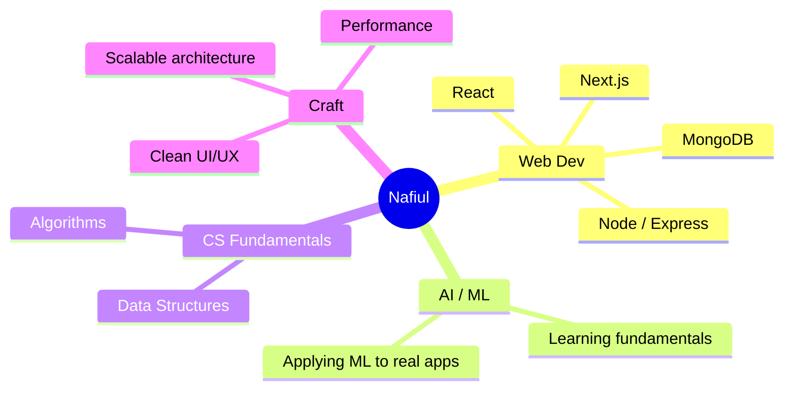

<div align="center">


<p>
  <a href="https://nafiulnafis.me" target="_blank">
    
  </a>
  <a href="mailto:nafiulnafis@gmail.com">
    
  </a>
</p>


</div>

<br/>

## About Me

```yaml
name: Nafiul Islam Nafis
role: CSE Undergraduate @ BRAC University (2024 – 2028)
focus: Full-Stack Web Development (MERN)
exploring: Artificial Intelligence & Machine Learning
values: [clean UI/UX, performance, scalable architecture]
```

- 🎓 Studying Computer Science & Engineering at **BRAC University**
- 💻 Building full-stack apps with the **MERN** stack
- 🤖 Learning **AI/ML** and how to bring it into real products
- 🧩 Care about clean design, fast apps, and code that scales
- 📫 Reach me at **nafiulnafis@gmail.com**

<br/>

## Tech Stack

<div align="center">


</div>

<br/>

## GitHub Stats

<div align="center">
  
</div>

<div align="center">
  
</div>

<br/>

## Where My Focus Is



*(GitHub renders this diagram natively — no external service, nothing to set up.)*

<br/>

## Contribution Snake

<div align="center">

<!--START_SECTION:snake-->

<!--END_SECTION:snake-->

</div>

<br/>

## Connect With Me

<p align="center">
  <a href="https://linkedin.com/in/nafiulnafis" target="_blank">
    
  </a>
  <a href="https://instagram.com/nafiulnafis" target="_blank">
    
  </a>
  <a href="https://www.hackerrank.com/nafiulnafis" target="_blank">
    
  </a>
  <a href="https://codeforces.com/profile/nafx" target="_blank">
    
  </a>
  <a href="https://leetcode.com/nafiulnafis" target="_blank">
    
  </a>
</p>

